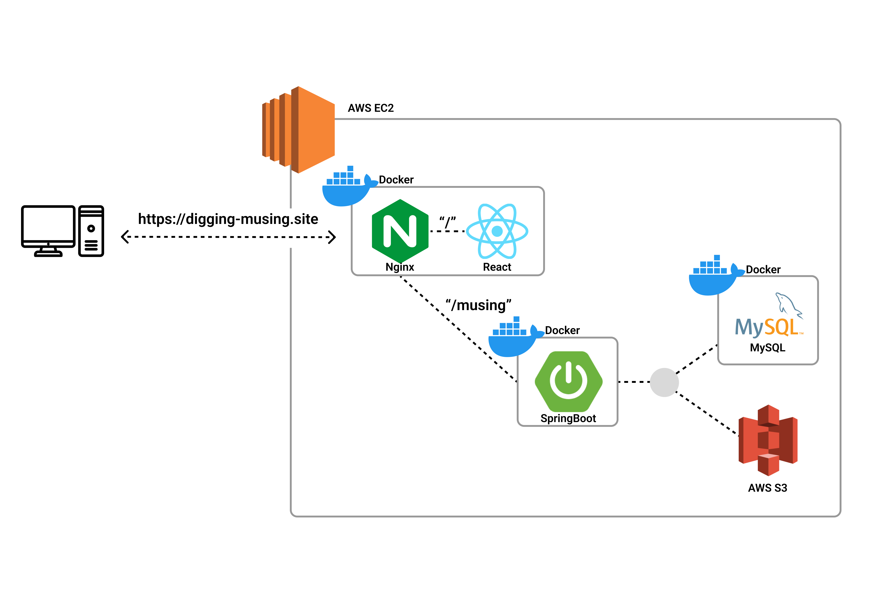

## 👋 소개

좋아하는 음악을 공유하고, 모두의 취향을 발견하세요!  
**Musing**은 사용자가 자신이 좋아하는 곡을 게시글로 올리고, 다른 사람들과 자유롭게 음악을 추천·공유할 수 있는 음악 추천 웹 애플리케이션입니다.
 
사이트 내에서 플레이리스트를 생성하고, 유튜브 계정과 연동하여 나만의 음악 컬렉션을 만들 수 있습니다.  
다른 사용자가 공유한 곡도 내 플레이리스트에 추가해 유튜브와 연동할 수 있습니다.

# <a href="https://digging-musing.site/" target="_blank">Musing</a> - 음악 추천 및 플레이리스트 생성 사이트
|  |
| --- |
| 회원가입 및 장르 관련 추천 |

|  |  |
| --- | --- |
| 플레이리스트 연동 | 플레이리스트 곡추가 |

### 🛠️ 사용 기술

**Backend**

**Database & Storage**

**DevOps**

**Frontend**

## 🕒 프로젝트 기간

2024.12.16 ~ 2025.06.14 **(3개월(1차)+3개월(2차 및 유지보수))** 

## 🎯 프로젝트 목적

- 유튜브 API 기반 음악 플레이리스트 연동 및 생성 기능 구현

- 직관적이고 감각적인 UI/UX로 음악 추천 경험 제공

- 커뮤니티 기반 곡 추천, 별점 및 댓글, 좋아요 등 소셜 기능

## 📈 기대효과

**사용자 경험 향상**

- 유튜브 연동으로 곡 감상 및 플레이리스트 관리의 편의성 제공

- 사용자 맞춤 곡 추천 기능

- 다양한 장르와 취향의 음악을 쉽게 탐색·공유

- SSE(Server-Sent Events) 기반 실시간 알림 시스템 구현

- OAuth 2.0 기반 소셜 로그인으로 간편한 사용자 인증 지원

**시스템 안정성 및 확장성**

- Docker 컨테이너화로 일관된 운영 환경 유지

- AWS EC2, S3 등 클라우드 인프라로 확장성 확보

**운영 효율성 개선**

- 관리자 페이지에서 신고 및 게시글 확인

## 📋 주요 기능

**🔑 사용자 인증**
- **OAuth 2.0 인증**: 소셜 로그인(구글, 유튜브) 기반 회원가입 및 로그인

- **JWT 토큰 관리**: Access/Refresh 토큰 기반의 안전한 사용자 인증

**🗂 마이페이지**
- **프로필 관리**: 자신의 선호 장르 및 분위기, 아티스트 추가 및 수정
- **플레이리스트 관리**: 플레이리스트 조회 및 수정 및 삭제
- **활동 내역**: 좋아요, 자신이 작성한 게시글/별점 및 댓글 기록 확인
- **알림**: SSE 기반 실시간 알림

**🎶 음악 추천 및 공유**

- **사용자 음악 추천**: 랜덤한 장르, 자신의 선호 장르 및 분위기, 아티스트 등의 정보를 토대로 추천
- **음악 추천 게시판**: 사용자가 곡을 게시글로 등록, 유튜브 링크와 함께 공유
- **검색 기능**: 곡명, 아티스트, 장르 등 다양한 기준으로 음악 검색
- **좋아요/별점 및 댓글**: 곡에 대한 피드백 및 커뮤니케이션 지원

**📂 플레이리스트 관리**
- **플레이리스트 생성 및 관리**: 사이트 내에서 유튜브와 연동된 나만의 플레이리스트 생성 또는 관리
- **유튜브 연동**: 내 플레이리스트를 유튜브 계정과 연동, 곡 추가 및 동기화

**👥 관리자 기능**
- **게시물 관리**: 음악 추천 게시글 승인 및 확인
- **신고 관리**: 신고에 따른 적절한 처리 지원

## 🤝 협업 도구 & 워크플로우

 

- **작업 관리**: Notion 및 Discord로 회의록 및 이슈,수정사항 공유

- **문서 관리**: Notion에 프로젝트 설계 및 기술 문서 기록

## 💻 배포 환경
**서버 아키텍처**  
**배포 URL**: https://digging-musing.site  
- **AWS EC2 기반 웹서버**
  - EC2 인스턴스에 NGINX Reverse Proxy 및 Docker Compose 기반 서비스 운영

- **Docker Compose 활용**
  - Backend, Frontend, DB, NGINX 모두 컨테이너화하여 관리
     
  
